# Terraform Infrastructure Setup for Azure

Table of Contents
=================

* [Terraform Infrastructure Setup for Azure](#terraform-infrastructure-setup-for-azure)
   * [Overview](#overview)
   * [Step-by-Step Process](#step-by-step-process)
      * [Initial Setup](#initial-setup)
      * [Base Resources](#base-resources)
      * [App Service Infrastructure](#app-service-infrastructure)
      * [Application Insights](#application-insights)
      * [Azure Container Registry (ACR)](#azure-container-registry-acr)
      * [Azure Key Vault](#azure-key-vault)
      * [Azure SQL Server + Private Endpoint](#azure-sql-server--private-endpoint)
      * [Storage Account for App Service File Share](#storage-account-for-app-service-file-share)
      * [Storage Account for Terraform State](#storage-account-for-terraform-state)
      * [Access Control](#access-control)
      * [Modularity](#modularity)
   * [Infrastructure Deployment Process](#infrastructure-deployment-process)
      * [Step 1: Initial Run (without backend)](#step-1-initial-run-without-backend)
      * [Step 2: Backend Configuration](#step-2-backend-configuration)
   * [Screenshots](#screenshots)
      * [After Step 1:](#after-step-1)
      * [After Step 2:](#after-step-2)
* [Home work 11.04.25](#home-work-110425)
   * [Setting Up CI/CD with Trunk-Based Development and Azure Pipelines](#setting-up-cicd-with-trunk-based-development-and-azure-pipelines)
      * [Adding CI/CD](#adding-cicd)
      * [Write terraform pipline in Azure](#write-terraform-pipline-in-azure)
      * [Write Azure connection](#write-azure-connection)
   * [Infrastructure Deployment Process](#infrastructure-deployment-process-1)
      * [Step one, creating initial resources and rolling over terraform.state](#step-one-creating-initial-resources-and-rolling-over-terraformstate)
      * [Step two, connect Azure Resource Manager to Azure DevOps.](#step-two-connect-azure-resource-manager-to-azure-devops)
      * [Step three, utilization, we can do RP and deploy infrastructure through Azure DevOps.](#step-three-utilization-we-can-do-rp-and-deploy-infrastructure-through-azure-devops)
   * [Screenshots](#screenshots-1)
      * [After Step 1:](#after-step-1-1)
      * [After Step 2:](#after-step-2-1)
      * [After Step 3:](#after-step-3)

## Overview

This project performs the task of creating a complete Terraform infrastructure on Azure, including:

 - 1 App Service Plan
 - 1 App Service - integrate with VNet, enable System Managed Identity
 - 1 Application Insights - linked to App Service
 - 1 ACR - Azure Container Registry, grant App Service Identity access to it
 - 1 Key Vault - grant permissions to App Service Identity, integrate with VNet
 - 1 VNet
 - 1 MS SQL Server DB - Private Endpoint needs to be configured
 - 1 Storage account - configure Private Endpoint with VNET and mount Fileshare to App Service
 - 1 Storage account for Terraform state

---

## Step-by-Step Process

### Initial Setup

Created the following Terraform files:

- `main.tf`
- `variables.tf`
- `terraform.tfvars`
- `.gitignore`

---

### Base Resources
Created Resource Group and Virtual Network with two subnets:
  - Public Subnet  
  - Subnet for Private Endpoints  

---

### App Service Infrastructure
Created App Service Plan and App Service with:
  - VNet Integration  
  - System Assigned Managed Identity  
  - Application Insights (via instrumentation key)

---

### Application Insights
Created `azurerm_application_insights` with the help of which the toolkit key is transferred to the App Service.

---

### Azure Container Registry (ACR)
Created ACR and assigned `AcrPull` role to the App Service Managed Identity.

---

### Azure Key Vault
Created Key Vault, access granted to App Service Identity via `azurerm_key_vault_access_policy` and configured Private Endpoint  

---

### Azure SQL Server + Private Endpoint
Created SQL Server and SQL Database and setup Private Endpoint.

---

### Storage Account for App Service File Share
Created Storage Account, File Share and configured Private Endpoint.

---

### Storage Account for Terraform State
Created anouther Storage Account for Terraform State.

---

### Access Control
Used `azurerm_role_assignment` for assigning roles App Service to ACR (`AcrPull`)  

---

### Modularity

After setting up everything in `main.tf`, the file was split into the following modules for better structure:

```
modules/
├── app_service
├── container_registry
├── database
├── key_vault
├── network
└── storage
```

Then, `main.tf` was updated to use these modules.

---

## Infrastructure Deployment Process

### Step 1: Initial Run (without backend)

```bash
terraform init
terraform apply \
  -target=azurerm_resource_group.rg \
  -target=azurerm_storage_account.tfstate \
  -target=azurerm_storage_container.tfstate
```

### Step 2: Backend Configuration

```bash
terraform init   # with backend
terraform apply
```

---

## Screenshots

### After Step 1:
 
  <p align="center">Resource group</p>
  

  <p align="center">Container</p>
  

  <p align="center">Container ftstate</p>
  

  <p align="center">terraform.tfstate before backend</p>

### After Step 2:


<p align="center">terraform.tfstate after backend</p>


<p align="center">Container ftstate with terraform.tfstate</p>


<p align="center">terraform.tfstate settings</p>


<p align="center">All resources</p>


<p align="center">All resources (continued)</p>

---
# Home work 11.04.25

## Setting Up CI/CD with Trunk-Based Development and Azure Pipelines

### Adding CI/CD 
Before I started working, I took a course on the Azure DevOps pipeline and started using Trunk-Based Development.

### Write terraform pipline in Azure
Next, I created a terraform.yml to use in Azure DevOps. For the commit in the master, I used the 'terraform init', 'terraform validate', and 'terraform apply' steps. For RP, the 'terraform init', 'terraform validate', and 'terraform plan' steps are used.

### Write Azure connection
Next, I connected GitHub and Azure Resource Manager to the project in Azure DevOps, then I created a Variable group for variables that are not required for the deployment, and in Azure, I gave the Service principal User Access Administrator rights so that the pipeline could create all the necessary resources.

## Infrastructure Deployment Process

### Step one, creating initial resources and rolling over terraform.state
```bash
terraform init
terraform apply \
  -target=azurerm_resource_group.rg \
  -target=azurerm_storage_account.tfstate \
  -target=azurerm_storage_container.tfstate
terraform init   # with backend
```
### Step two, connect Azure Resource Manager to Azure DevOps.

### Step three, utilization, we can do RP and deploy infrastructure through Azure DevOps.

## Screenshots
### After Step 1:

 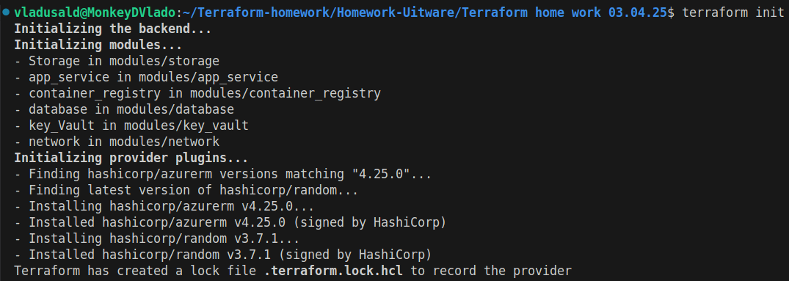
  <p align="center">Terraform init</p>

 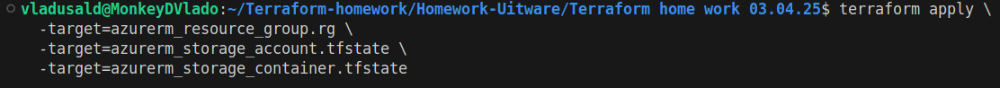
  <p align="center">Terraform apply</p>

 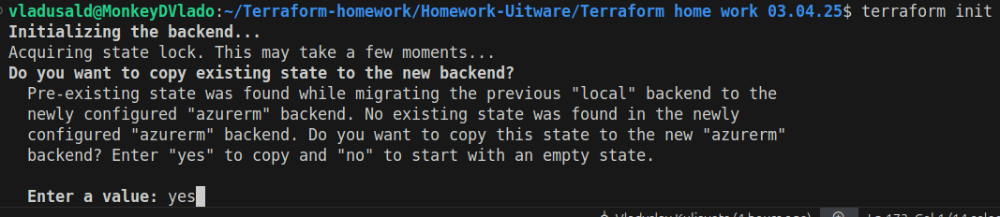
  <p align="center">Terraform init beckend</p>

 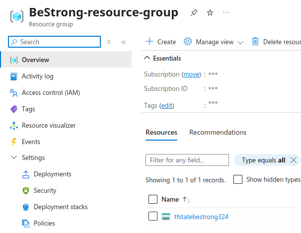
  <p align="center">Created resourse group</p>

 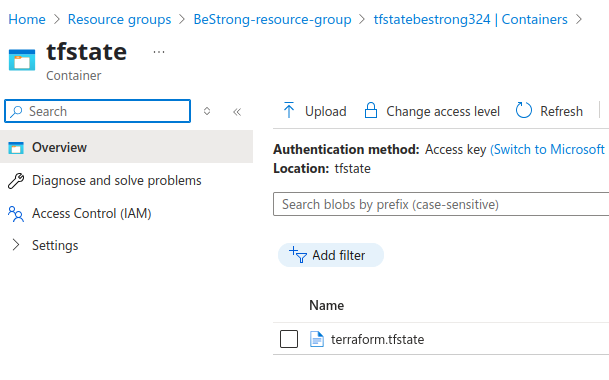
  <p align="center">Conteiner with terraform state</p>

### After Step 2:

 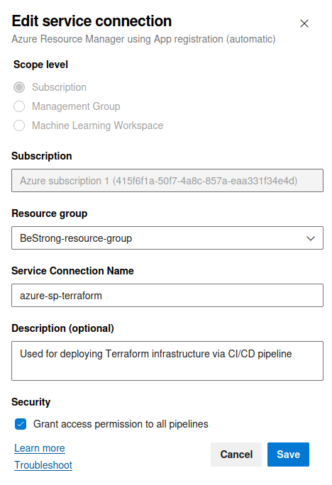
  <p align="center">Added connection in Azure DevOps</p>

 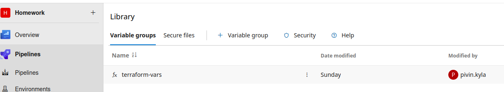
  <p align="center">Terraform var in Azure DevOps</p>

### After Step 3:

 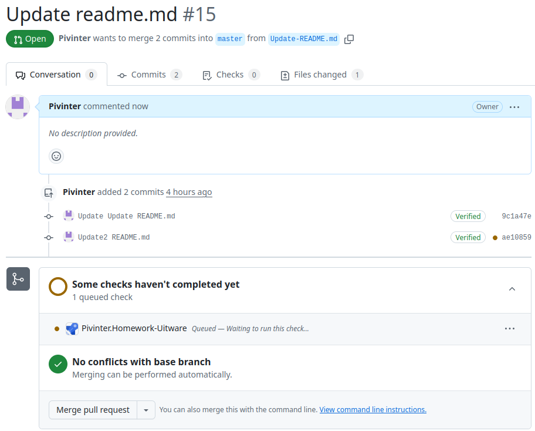
  <p align="center">Create PR</p>

 
  <p align="center">Done pipeline with terraform plan</p>

 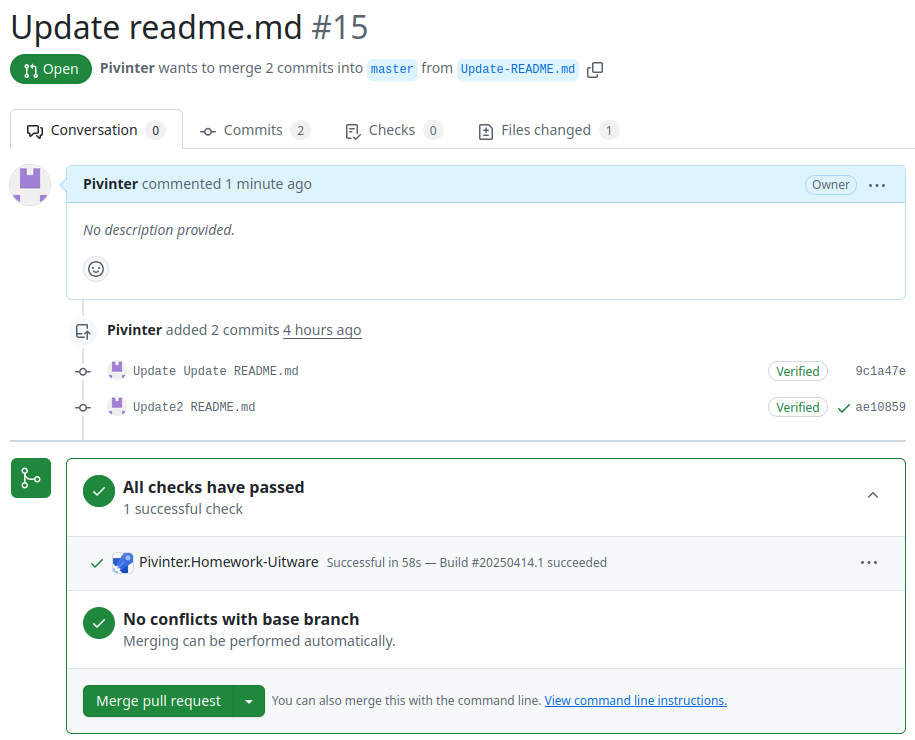
  <p align="center">Done pipeline in GitHub</p>

 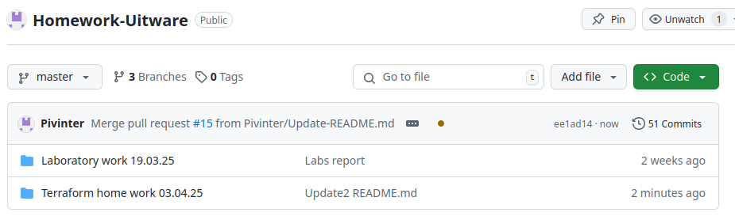
  <p align="center">Merge</p>

 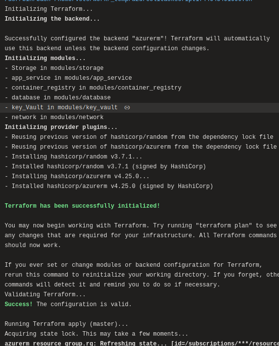
  <p align="center">Done pipeline tf apply</p>

 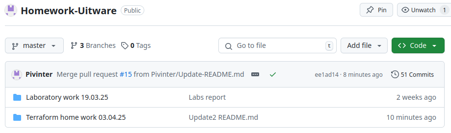
  <p align="center">Done pipeline GitHub tf apply</p>

 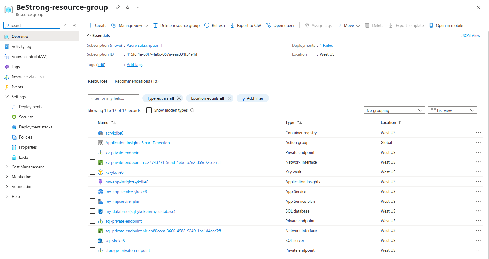
  <p align="center">Done work in Azure</p>

 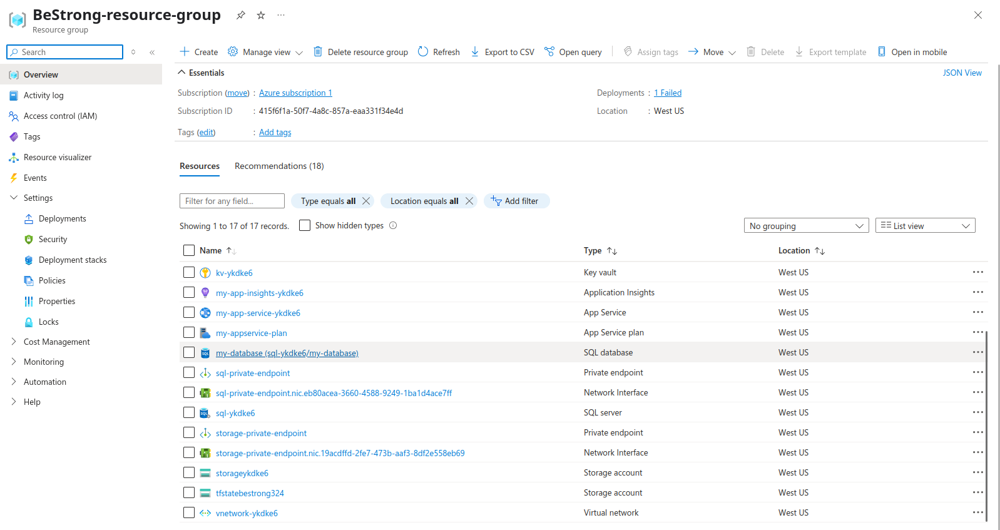
  <p align="center">Done work in Azure part 2</p>
