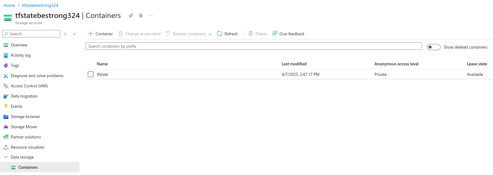
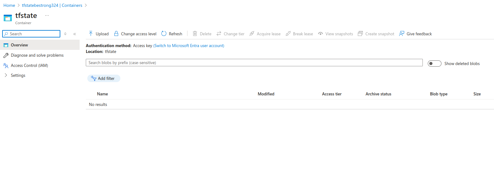
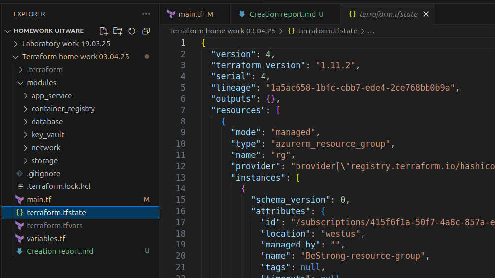
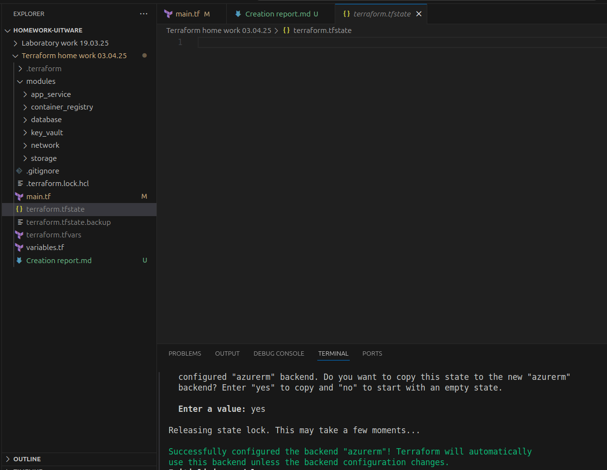
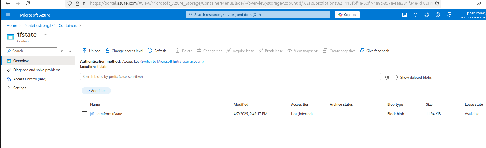
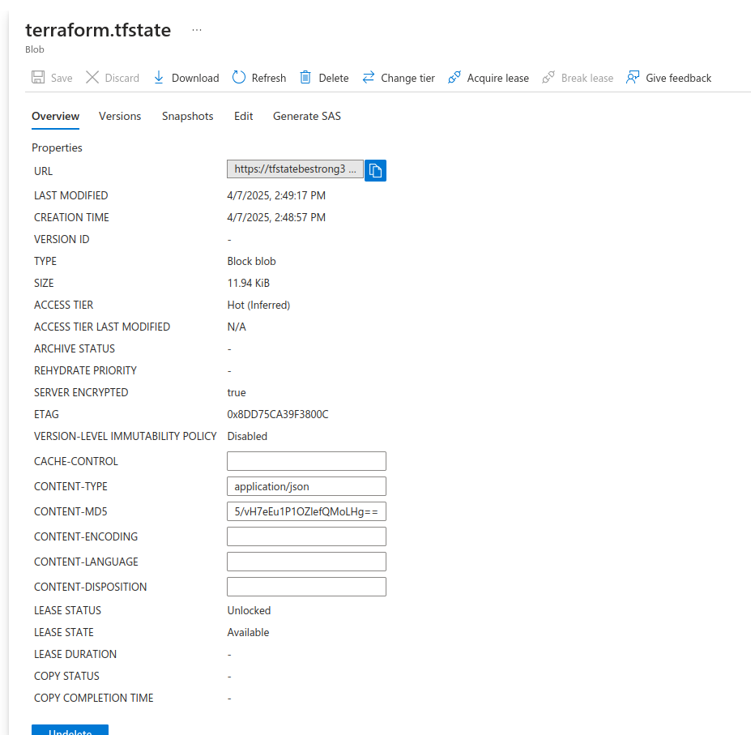
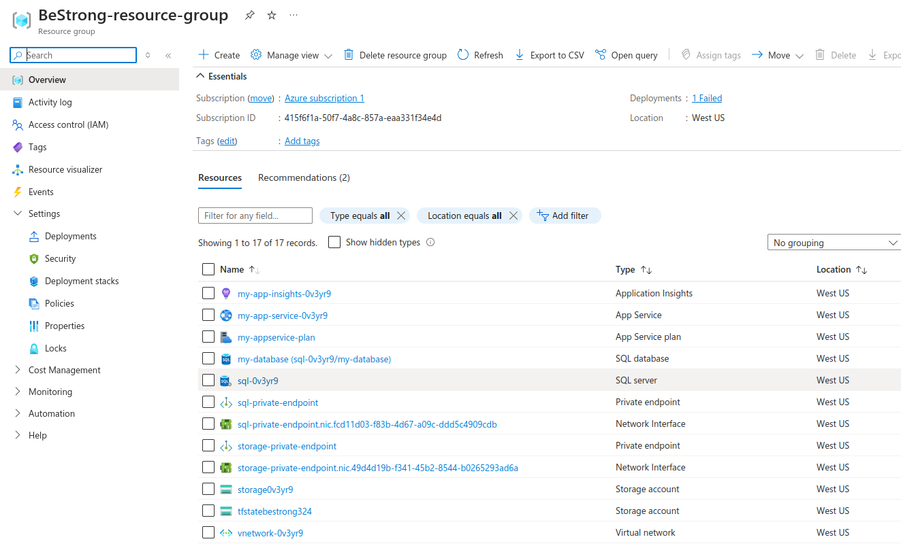

Performing the task of creating the Terraform infrastructure:
        1 App Service Plan
        1 App Service - integrate with VNet, enable System Managed Identity
        1 Application Insights - linked to App Service
        1 ACR - Azure Container Registry, grant App Service Identity access to it
        1 Key Vault - grant permissions to App Service Identity, integrate with VNet
        1 VNet
        1 MS SQL Server DB - Private Endpoint needs to be configured
        1 Storage account - configure Private Endpoint with VNET and mount Fileshare to App Service
        1 Storage account for Terraform state

First, I created the main files main.tf, variables.tf, terraform.tfvars and .gitgnore

Next, I created the basic resources
1 Resource Group
2 Virtual Network with subnets:
    Public subnet
    Subnet for private endpoints

Next, I created the App Service infrastructure
1 App Service Plan
2 App Service with:
    VNet Integration
    System Assigned Managed Identity
    Application Insights linked via instrumentation key

I created Application Insights
    Create azurerm_application_insights resource
    Passing instrumentation_key to App Service

Next, I created the Azure Container Registry (ACR)
    Created the ACR
    Assigned the AcrPull role to the Managed Identity App Service

Next, I created an Azure Key Vault
    Created a Key Vault
    Provided access via azurerm_key_vault_access_policy for Managed Identity
    Set up a Private Endpoint

Next, I created Azure SQL Server + Private Endpoint
    Created SQL Server and SQL DB

Next, I created Storage Account (for App Service File Share)
    Stvoriv Storage Account
    Create File Share
    Set up Private Endpoint

Next, I created a Storage Account for Terraform state
    One Storage Account separately for state files
    Used as a backend

Next, I created RBAC and access
    Wikorista azurerm_role_assignment for role assignment:
        App Service → ACR (AcrPull)

I created all this in main.tf. Then, for better navigation, I divided this file into modules:
modules
    app_service
    container_registry
    database
    key_vault
    network
    storage

And updated the main.tf to use the modules.

The infrastructure is launched in two stages, the first without a backend:
Run:
terraform init
terraform apply -target=azurerm_resource_group.rg -target=azurerm_storage_account.tfstate -target=azurerm_storage_container.tfstate

Second step, use the backend to move terraform.tfstate to a container in Azure:
Run:
terraform init #з бекендом
terraform apply

Files after the first step:

Files after the Second step:

